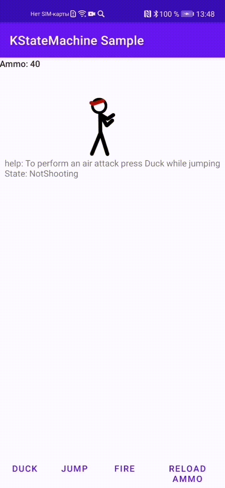

# android-kstatemachine-sample

## Sample 2D shooter game

This is a sample Android application showing [KStateMachine](https://github.com/nsk90/kstatemachine) library features.
This application fallows MVI architecture pattern.

State machine is used to define and control Hero states like in 2D shooter games.

  

## How to build

* Build with Android studio or run `./gradlew` script.
* Run on Android device or emulator.
